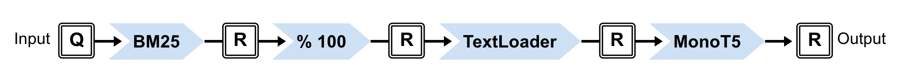

[](https://github.com/terrier-org/pyterrier/actions/workflows/push.yml)
[](https://badge.fury.io/py/python-terrier)
[](https://pyterrier.readthedocs.io/en/latest/)


# PyTerrier

PyTerrier - v1.0

<p align="center">
  🔍 <b>Retrieve.</b> 🧠 <b>Rerank.</b> 💬 <b>Answer.</b> ⚙️ <b>Experiment.</b>
</p>


# Overview

Build (sparse|learned sparse|dense) indexing and retrieval pipelines for search and RAG use-cases, and conduct experiments on standard datasets.

For example, build a re-ranking pipeline combining a Terrier BM25 retriever and the MonoT5 neural reranker (each of these are PyTerrier [Transformer](https://pyterrier.readthedocs.io/en/latest/transformer.html) classes):

```python
import pyterrier as pt
import pyterrier_t5
bm25 = pt.terrier.TerrierIndex.from_hf("pyterrier/vaswani.terrier").bm25()
monot5 = bm25 >> pt.get.get_text(pt.get_dataset('irds:vaswani')) >> pyterrier_t5.MonoT5ReRanker()
monot5.search("What are chemical reactions?")
```

In notebook environments, PyTerrier transformers and pipelines can be visualised.



You can easily build pipeline for [query expansion](https://pyterrier.readthedocs.io/en/latest/rewrite.html), [learning-to-rank](https://pyterrier.readthedocs.io/en/latest/ltr.html), [dense retrieval](https://pyterrier.readthedocs.io/en/latest/ext/pyterrier-dr/overview.html) and even [RAG](https://pyterrier.readthedocs.io/en/latest/ext/pyterrier-rag/index.html).

Once you have working pipelines, you can formulate an experiment to compare their effectiveness using the [pt.Experiment](https://pyterrier.readthedocs.io/en/latest/experiments.html) function:
```python
from pyterrier.measures import *
pt.Experiment(
  [bm25, monot5]
  pt.get_dataset('vaswani').get_topics(),
  pt.get_dataset('vaswani').get_qrels(),
  [nDCG@10, AP@100]
)
```

You can easily perform retrieval experiments using many [standard datasets](https://pyterrier.readthedocs.io/en/latest/datasets.html), including all from the [ir_datasets package](https://github.com/allenai/ir_datasets). E.g., use `pt.datasets.get_dataset("irds:medline/2004/trec-genomics-2004")`
to get the TREC Genomics 2004 dataset. A full catalogue of ir_datasets is available [here](https://ir-datasets.com/all.html).


# Installation

The easiest way to get started with PyTerrier is to use one of our Colab notebooks - look for the  badges below.

### Linux or Google Colab or Windows or macOS
1. `pip install pyterrier[all]`
2. You may need to set JAVA_HOME environment variable if Pyjnius cannot find your Java installation. On Colab, we install Java automatically.

# PyTerrier Extensions

PyTerrier has additional plugins for everything from dense retrieval to RAG:

 - Pyterrier_DR: [[Github](https://github.com/terrierteam/pyterrier_colbert)] - single-representation dense retrieval
 - Pyterrier_RAG: [[Github](https://github.com/terrierteam/pyterrier_rag)] - retrieval augmented generation and LLM access
 - PyTerrier_ColBERT: [[Github](https://github.com/terrierteam/pyterrier_colbert)] - mulitple-representation dense retrieval and/or neural reranking
 - PyTerrier_PISA: [[Github](https://github.com/terrierteam/pyterrier_pisa)] - fast in-memory indexing and retrieval using [PISA](https://github.com/pisa-engine/pisa)
 - PyTerrier_T5: [[Github](https://github.com/terrierteam/pyterrier_t5)] - neural reranking: monoT5, duoT5
 - PyTerrier_GenRank [[Github](https://github.com/emory-irlab/pyterrier_genrank)] - generative listwise reranking: RankVicuna, RankZephyr
 - PyTerrier_doc2query: [[Github](https://github.com/terrierteam/pyterrier_doc2query)] - neural augmented indexing
 - PyTerrier_SPLADE: [[Github](https://github.com/cmacdonald/pyt_splade)] - neural augmented indexing

You can see examples of how to use these, including notebooks that run on Google Colab, in the contents of our [Search Solutions 2022 tutorial](https://github.com/terrier-org/searchsolutions2022-tutorial).

# Open Source Licence

PyTerrier is subject to the terms detailed in the Mozilla Public License Version 2.0. The Mozilla Public License can be found in the file [LICENSE.txt](LICENSE.txt). By using this software, you have agreed to the licence.

# Citation Licence

The source and binary forms of PyTerrier are subject to the following citation license: 

By downloading and using PyTerrier, you agree to cite at the undernoted paper describing PyTerrier in any kind of material you produce where PyTerrier was used to conduct search or experimentation, whether be it a research paper, dissertation, article, poster, presentation, or documentation. By using this software, you have agreed to the citation licence.

[Declarative Experimentation in Information Retrieval using PyTerrier. Craig Macdonald and Nicola Tonellotto. In Proceedings of ICTIR 2020.](https://arxiv.org/abs/2007.14271)

```bibtex
@inproceedings{pyterrier2020ictir,
    author = {Craig Macdonald and Nicola Tonellotto},
    title = {Declarative Experimentation inInformation Retrieval using PyTerrier},
    booktitle = {Proceedings of ICTIR 2020},
    year = {2020}
}

```

# Credits

 - Craig Macdonald, University of Glasgow
 - Sean MacAvaney, University of Glasgow
 - Nicola Tonellotto, University of Pisa
 - Alex Tsolov, University of Glasgow
 - Arthur Câmara, TU Delft
 - Alberto Ueda, Federal University of Minas Gerais
 - Sean MacAvaney, University of Glasgow
 - Chentao Xu, University of Glasgow
 - Sarawoot Kongyoung, University of Glasgow
 - Zhan Su, Copenhagen University
 - Marcus Schutte, TU Delft
 - Lukas Zeit-Altpeter, Friedrich Schiller University Jena
